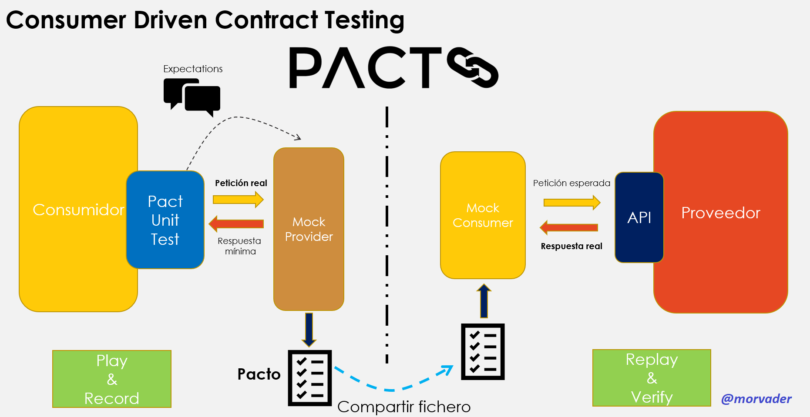

# Introducción
A día de hoy, es extraño encontrarnos con un sistema que se desarrolle de manera “monolítica”, cada vez es más habitual, por las ventajas que ello supone, dividirlo en componentes más pequeños que se comunican entre sí para cubrir las necesidades esperadas. 
Esto hace que la funcionalidad no se encuentre concentrada en un único punto, si no que sea la colaboración de todas las partes la que dé sentido al sistema.
Lo recomendable es que cada una de estas partes tenga programadas unas pruebas unitarias que verifiquen que el componente se comporte correctamente de manera aislada. No obstante, como bien sabemos, que cada módulo funcione correctamente de manera individual no garantiza que el sistema se vaya comportar adecuadamente en conjunto.

En este punto, se podría pensar que unas pruebas de integración del sistema completo serían la solución, y en cierta medida lo son, no obstante,en muchas ocasiones, no resulta sencillo realizar este tipo de pruebas bien por su complejidad, bien porque “levantar” todo el sistema no es sencillo, porque haya partes que aún no estén terminadas, etc. En definitiva, hay muchos factores que pueden hacer que en un entorno orientado a microservicios realizar una batería completa de pruebas de integración resulte altamente complejo.

En este tipo de situaciones, es donde enfoques como el del testing orientado a contratos aportan un mayor valor. En esencia, se trata de establecer lo que espera recibir el consumidor ante unas determinadas peticiones y posteriormente verificar que efectivamente el productor está enviando las respuestas esperadas, tanto en forma como en datos. Estos contratos se generan mediante el mockeo del servidor, por tanto, se crean antes de comenzar el desarrollo del mismo, de manera que se garantiza que éste produce en todo momento las respuestas adecuadas.

Esto favorece la detección temprana de errores, ya que estas pruebas no necesitan tener toda la infraestructura del sistema levantas, únicamente el proveedor que estemos desarrollando y deseemos validar. Por tanto, en el momento que el contrato deje de cumplirse por parte de dicho proveedor seremos informados del error.

Existen varias librerías que dan soporte a este tipo de pruebas. En esta charla me centraré en el uso de PactJS.

## Contract Testing con PACT

[Pact](https://docs.pact.io) es un framework **open source** que facilita el testing de componentes basándose en contratos. Sus principales ventajas son:
- Open source
- Bien documentado
- Comunidad activa
- Soporte para los principales lenguajes (Ruby, .Net, Java, JS, PHP, etc.)
- Modelo "*Consumer Driven*"


## Consumer Driven Contract Testing

A la hora de realizar cualquier cambio en un sistema donde se sigue una arquitectura de proveedor/consumidor, el eslabón más débil de la cadena siempre será el consumidor y el que, principalmente, sufrirá los efectos de cualquier error. 
En cualquier sistema orientado a servicios, se debe garantizar en todo momento que los consumidores de éstos, siguen operando con normalidad. Es por ello que se debe prestar especial atención a la hora de mantener la compatibilidad entre ambos sistemas. Esto es, principalmente, que el formato de las peticiones y respuestas sea el esperado en cada parte respectivamente.

Es por ello que en determinados tipos de soluciones tiene más sentido que sea el cliente quién "*tome la iniciativa*" a la hora definir las reglas de comunicación entre las partes. En la práctica. Este enfoque no implica que sea el cliente el que "dicte" las normas, en todo caso, el pacto debe surgir de una comunicación entre parte y plasmar los acuerdos que se hayan tomado.

## Cómo funciona

El framework **Pact** establece un workflow de trabajo determinado y aporta una serie de utilidades que permite llevarlo a cabo.
Los elementos principales que forman parte de este flujo son:
- Expectations (Interacciones)
- Mock Provider
- Pact file
- Mock Consumer
- Pact Broker (opcional)

De manera resumida, tal y como se muestra en el diagrama, el flujo podría resumirse en dos partes: "**Play & Record**" y "**Replay & Verify**"

El orden de ejecución sería el siguiente:

1. Definir las "interacciones" entre cliente y proveedor. Es decir, qué debe responder el proveedor ante peticiones concretas del consumidor.
2. Crear pruebas unitarias que "ejerciten" las interacciones anteriormente definidas.
3. Lanzar dichas pruebas unitarias mediante Pact
4. Pact, de manera automática, arrancará en la máquina un local un servicio que mockeará el comportamiento del proveedor, esto es que, ante las peticiones lanzadas por las pruebas unitarias de nuestro cliente devolverá las respuetas previamente estableceidas, tal y como haría el servicio real en producción.
5. Esto nos permitirá verificar, antes de desplegar en producción, que nuestro cliente es compatible con las respuestas del proveedor.
6. Si las pruebas unitarias son correctas se generará un fichero JSON que contendrá el **PACTO**
7. Este fichero deberá ser compartido con el proveedor. *En cada proyecto y equipo de trabajo se deberá buscar la manera más adecuada de realizar esta acción. [Pact Broker](https://github.com/pact-foundation/pact_broker) pruede ser una opción interesate por sus ventajas
8. Arrancamos el proveedor
9. En el lado del consumidor lanzamos el verificador de pactos indicando la ubicación del fichero con el pacto
10. Pact, levantará en local un mock del consumidor, éste lanzará contra nuestro proveedor las llamadas previamente definidas y comprobará las respuestas con las esperadas
      



Trabajar con este framework aporta las siguientes ventajas:

- **Detección temprana de errores**: Verificamos la compatibilidad de nuestros sistemas antes de desplegar los sistemas
- **Escalable**: Estableceremos un pacto distinto por cada relación cliente-proveedor
- **Trabajo en paralelo**: Al mockear tanto el cliente como la del proveedor ambas partes podrán trabajar el paralelo, eliminando así las dependencias entre equipos.
- **Multi-tecnología**: Clientes y proveedores pueden estar desarrollados en diferentes lenguajes

## Ejemplos
### Configuración de PACT en cliente

* Propieades generales

```
const provider = new Pact({   
    consumer: 'Insert Films Client',
    provider: 'Films Provider',
    port: API_PORT,
    log: path.resolve(process.cwd(), 'logs', 'pact.log'),
    dir: path.resolve(process.cwd(), 'pacts'),
    logLevel: LOG_LEVEL,
    spec: 2
})
```

### Definición de interacciones

* Especificamos la interacción y la prueba unitaria que la ejercita

```
describe("Inserting films", () => {
    before(() => {
        filmService = new FilmsService(endPoint);
        //Start mock service
        return provider.setup();
    })
    
    after(() => {
        // Generate pact file
        return provider.finalize()
    })
    describe('When insert the meaning of life', () => {
        describe('monty phyton film should be inserted', () => {
            var pact_body = {"id": 42,
                        "Name": "Meaning of life",
                        "Description": "Comedy",
                        "Year": 1986}
            before(() => {
                //Interaccion
                //Peticion y respuesta esperada
                return provider.addInteraction({
                    state: 'Empty repository',
                    uponReceiving: 'Insert meaning of life',
                    withRequest: {
                        method: 'POST',
                        path: '/films/',
                        headers: {
                            'Content-Type': 'application/json'
                        },
                        body: pact_body
                    },
                    willRespondWith: {
                        status: 200,
                        headers: {
                            'Content-Type': 'application/json'
                        },
                        body: pact_body
                    }
                })
            })

            //Prueba unitaria que ejercita la petición establecida
            it('film is inserted', () => {
                return filmService.insertFilm(42)
                    .then(response => {
                        expect(response).to.be.not.null;
                        expect(response.id).to.equal(42);
                    });
            });
        })
    });
```
### Verificar en proveedor

  * El verificador de Pact se encargará de lanzar las peticiones contra el servicio y comprobar las respuestas con las especificadas

```
let clienteNormal = {
    provider:"Films Provider",
    providerBaseUrl: 'http://localhost:3000',
    providerStatesSetupUrl: 'http://localhost:3000/init',
    pactUrls: [path.resolve(__dirname, '../../pacts/films_client-films_provider.json')]
};

new Verifier().verifyProvider(clienteNormal).then(() => {
    console.log('success');
    process.exit(0);
}).catch((error) => {
    console.log('failed', error);
    process.exit(1);
});
```
